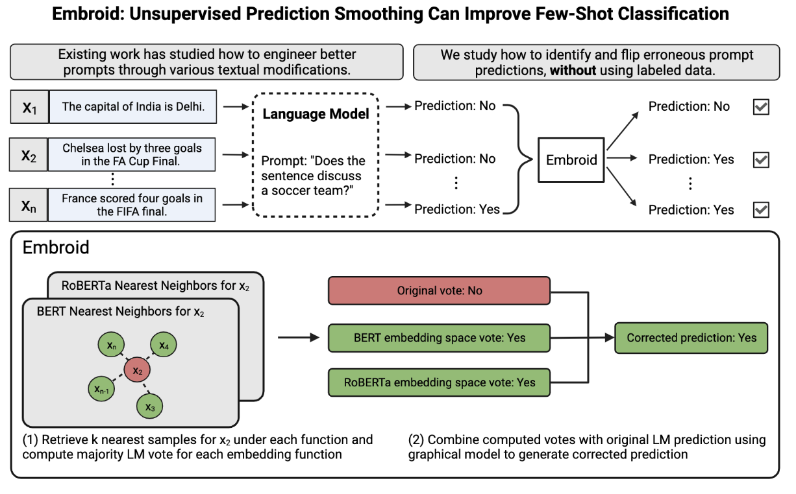

# Embroid

This repository provides the official implementation of Embroid from the following paper:

**Embroid: Unsupervised Prediction Smoothing Can Improve Few-Shot Classification**<br>
Neel Guha*, Mayee F. Chen*, Kush Bhatia*, Azalia Mirhoseini, Fred Sala, and Christopher Ré

Paper: <https://arxiv.org/abs/2307.11031>



## Overview

Embroid is a method for **smoothing** the predictions of a few-shot LM over a dataset, by averaging the LM's predictions for samples that are nearby under several different embedding functions (e.g., BERT, or Sentence-BERT). For more technical details, see the paper linked above. Embroid has several nice properties which make it useful in different settings:

- It is prompt agnostic and can be used to improve the performance of other prompt-engineering methods, like chain-of-thought prompting, or AMA.
- It is fast, because it builds on [FlyingSquid](https://github.com/HazyResearch/flyingsquid).
- It makes use of "small" LMs for embedding information (e.g., BERT, or SentenceBERT). Thus, it's computational footprint is manageable for most settings.
- We generally find it improves a wide range of commercial models (e.g., GPT-3.5) and open-source models!

The typical workflow is:

1. Generate predictions from one or more LMs for a dataset.
2. Embed this dataset with several different embedding models (e.g., BERT, RoBERTa, SentenceBERT).
3. Apply Embroid to generated predictions and embeddings. Hopefully, the performance of Embroid predictions should be higher than the original predictions!

## Guidance on usage

- Embroid is supported for binary classification tasks, or multi-way classification tasks that can be binarized through multiple one-vs-all predictions. Embroid is ideal for "topic" or "property" classification tasks. For example:
  - Classifying whether a text fragment references a particular entity (e.g., the United States Men's Soccer Team)
  - Classifying whether a text fragment corresponds to a particular subject (e.g., business news)
  - Classifying whether a text fragment is of a certain type (e.g., an audit right contractual clause).

- Embroid is a transductive method, so performance improves as the dataset size increases.
- We recommend embeddings which match the domain of the task (e.g., legal models for legal tasks). Huggingface is a good source of different embeddings.
- Embroid generates additional predictions for each sample by converting each embedding space into a weak predictor. Because these predictions are combined using Flying Squid, Embroid requires the use of **at least two embedding spaces**.

## Setup

Dependencies are handled via [Poetry](https://python-poetry.org/).

```bash
poetry install . # Install all dependencies
poetry run jupyter notebook # To run notebook
```

## Relevant folders

- `demo.ipynb` provides a simple demonstration of Embroid.
- `figs/` contains figures for the README.
- `data/` stores pickle files corresponding to labels, predictions, and embeddings for `demo.ipynb`.
- `poetry.lock` and `pyproject.toml` enable Poetry.

## Citation

```
@article{guha2023embroid,
  title={Embroid: Unsupervised Prediction Smoothing Can Improve Few-Shot Classification},
  author={Guha, Neel and Chen, Mayee F and Bhatia, Kush and Mirhoseini, Azalia and Sala, Frederic and R{\'e}, Christopher},
  journal={arXiv preprint arXiv:2307.11031},
  year={2023}
}
```

## Contact

For questions, comments, or concerns, reach out to Neel Guha (<nguha@stanford.edu>).
